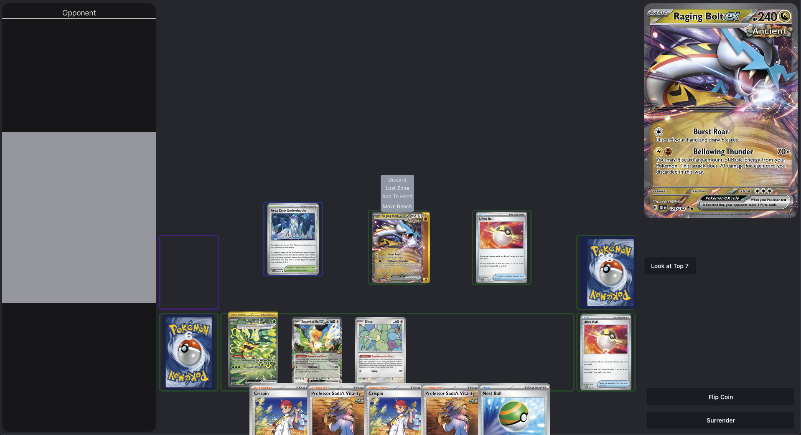

# 🃏 Pokémon TCG Simulator

A browser-based Pokémon Trading Card Game simulator built to test decks, manage card collections, and simulate matches between players.  
Designed with a focus on simplicity, speed, and custom deck control.

---

## 🌟 Features

- 🧩 **Deck Builder** – Create, import, and edit custom decks with a visual interface.  
- ⚔️ **Battle Simulator** – Playtest decks with drag-and-drop functionality and card interactions.  
- 🔍 **Search Functionality** – Find cards by name, type, or text.  
- 💾 **Persistent Deck Storage** – Save, rename, and delete decks easily.  
- 💬 **Interactive UI** – Hover and click to view full card details.  

---

## 🖼️ Screenshots

### 🧱 Deck Editor
Manage your decks, view card details, and import/export builds.

<p align="center">
  
</p>

---

### ⚡ Battle Simulator
Playtest decks in a turn-based simulation environment.

<p align="center">
  
</p>

---

## 🧰 Tech Stack

- **Frontend:** React, TypeScript, Tailwind CSS  
- **Backend:** Node.js (optional)  
- **Data Source:** Pokémon TCG API / Custom JSON datasets  
- **State Management:** React Context / Zustand  

---

## 🚀 Getting Started

1. Clone the repository:
   ```bash
   git clone https://github.com/JoMa388/pokemon-tcg-simulator.git
